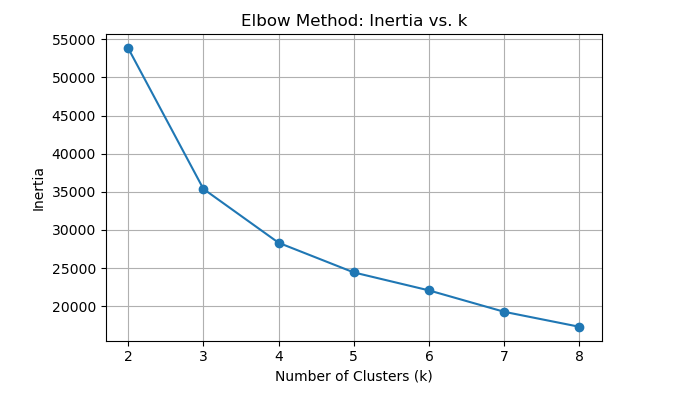
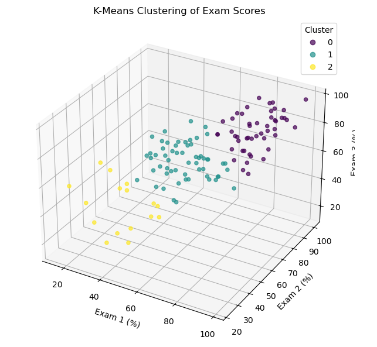

# Exploring Predictive Models for Student Performance: A Case Study in Life Science Calculus I Exam Data Modeling

## Real-World Problem Statement
**Full statement of the problem:**  
With final exams quickly approaching, students are often dreading the finals grind filled with lots of caffeine and an overwhelming amount of studying. Professors are equally yearning for the semester’s close as class attendance dwindles and assignments to finish grading stack up. 

But are final exams an accurate representation of student knowledge and performance in a course – or can we just accept the exams taken during the semester as good enough?

## Assumptions
1. **Exam scores reflect student learning and effort.**  
   Exams are standardized and graded consistently.  
2. **In absence of final grade data, Exam 3 can serve as a proxy for overall course performance.**
3. **All exams cover the same amount of content**
4. **All exams have the same difficulty**
5. **Content delivered to students consistently throughout the semester**

*Why these are sensible:*  
- Midterm exams are designed to test core course material, so their scores should reflect student learning and effort.  
- Using Exam 3 as a stand-in for final performance allows us to move forward without needing official final grades, which fits within our project timeline.  
- Assuming all exams cover the same amount of material and are equally difficult makes it reasonable to compare scores directly across exams.  
- Consistent delivery of content throughout the semester supports the idea that exam scores measure the same skills and knowledge at each point.  
- Standardized grading ensures that differences in scores are due to student performance rather than grading inconsistencies.

## Fields of Mathematics that might help
### 1. Statistics
*Analyze data on student performance across different exams in a standardized way*
- Descriptive statistics (like mean, medium, standard deviation, etc) to compare performance on midterm exams versus final exam
- Inferential statistics (like t-tests, ANOVA, etc) to determine if these differences are statistically significant
- Correlation and regression models (like linear or logistic regression) to see how well midterm exams predict final exam scores
### 2. Probability Theory
*Visualize data distribution of student performance for each exam* 
- Probability distributions to understand skewness, variability and outliers
- Bayesian inference to update prediction model by refining inferences as more student data is collected
### 3. Machine Learning
*To build predictive models for student success without relying solely on finals*
- Supervised learning (like linear regression) to try to predict final exam grades based on midterm exam grades
- Classification models to categorize students by their performance levels

## Modeling Setup and Dataset Information
The dataset was obtained from the USF Life Science Calculus I section 002 of Spring 2025. It contains information on students' exam scores for exams 1, 2 and 3. Students are all taught by the same professor and exams are graded by the same 4 graders. 

**Please note that the dataset is not included here because it contains sensitive information, and this page is publicly accessible.**

### Variables 
For the purposes of this project, the following variables were analyzed:
| Variable Name   | Description                              | Type     | Example Value |
|-----------------|------------------------------------------|----------|---------------|
| `SID`| Student ID | `number` | `123456788` |
| `Total Score`| Student's score on Exam | `number` | `98` |
| `Max Points`| Highest amount of Points a student could obtain | `number` | `105` |
| `Status`| Whether exam was graded or missing | `string` | `Graded or Missing` |

### Summary Statistics of the Dataset

**Code** 

[Summary_Stats Script](code/Student_Scores_Summary_Stats.ipynb)


Number of students: 160 
| Variable Name   | Exam 1     | Exam 2     | Exam 3     |
|-----------------|----------|----------|----------|
| `Mean`|  `59.163` | `73.064` | `66.531` |
| `Q1`|  `42.5` | `59.875` | `58.25` |
| `Q3`|  `78.0` | `90.125` | `77.75` |
| `Median`| `57.5` | `76.0` | `67.0` |
| `Maximum`|  `104.0` | `107.0` | `102.0` |
| `Minimum`|  `5.5` | `10.0` | `15.0` |
| `Count of Missing`|  `7` | `12` | `33` |
| `Max Points (Available)`|  `105` | `107` | `105` |


**Please Note:**
- Because each exam had a different maximum number of points available (e.g., 105, 107), **all exam scores were converted to percentages to ensure comparability across exams.**
- **Students missing a grade for any of the three exams were excluded from the final dataset.** This decision was made to maintain consistency in the analysis and to ensure that all models were trained and evaluated on complete information.

## How to Run the Code

1. **Get your Dataset:**  
   As previously mentioned, the dataset used will not be provided for privacy reasons. However, if you have data for an exam1, 2, and 3 you can use this. Ensure the data is in the csv format with the columns SID, Total Score, Status, and Max Points.

2. **Update the File Path:**  
   In the respective scripts, replace the file path in the following line with the location where you saved the dataset:
   ```
   exam1 = pd.read_csv("Exam_1_scores.csv")
   exam2 = pd.read_csv("Exam_2_scores.csv")
   exam3 = pd.read_csv("Exam_3_scores.csv")
   
3. **Run the Script:**
  Execute the file(s) in your Python/R environment.

## Mathematical Tools

- **Linear Regression**  
  - **Why:** To guess a student’s Exam 3 score from their Exam 1 and Exam 2 scores.  
  - **How:** We draw a straight line through the points so it’s as close as possible to all of them.  
  - **Hold-out Test:** We keep 20% of the data separate and train on the other 80%. Then we check the held-out 20% to make sure the line works on data it hasn’t seen. This helps us catch if the model is just memorizing the training data instead of learning the real pattern. This validation method was chosen for its simplicity.

- **Logistic Regression**  
  - **Why:** To guess a student's Exam 3 score from their Exam 1 and Exam 2 Scores.   
  - **How:** We changed the scores from Exam 3 into a binary variable. If a student's score was above a 70, the score was changed into a one. Any score below a 70 was changed to a 0.  
  - **Cross-Validation:** We kept 70% of the data for training the model, and the remaining 30% for testing the model. Model metrics such as accuracy, precision, and recall were developed from the testing data in the form of a confusion matrix. 

- **K-Means Clustering**  
  - **Why:** To find groups of students who have similar exam results.  
  - **How:**  
    1. **Elbow Plot:** We run K-Means with different numbers of groups, then plot “total distance within groups” (which we call inertia) versus k. We look for the “elbow” point where adding more groups stops improving the fit much. This helps us pick a sensible k without guessing.  
    2. **Group Assignment:** With that k, we place k center points, assign each student to the nearest center, then move each center to the average of its members, and repeat until nothing changes.  
    3. **Silhouette Score:** For each student, we measure how close they are to their own group versus the next nearest group and average those numbers. A higher silhouette score means students fit well in their groups and clusters are clear.


## Variations on the Same Theme

### Simplest Version of the Problem

The simplest version of our problem is:  
**Can we predict a student's Exam 3 score using only their Exam 1 and Exam 2 scores?**
 
- We **cut out** any information about homework, quizzes, participation, or attendance, even though these likely contribute to final course grades. These additional factors would require more complex models, and we do not have access to that data.
- We **kept** Exam 1 and Exam 2 scores because they are standardized, graded consistently, and readily available for all students. They provide a focused, measurable snapshot of student learning during the semester.
- By narrowing it down to only midterm exams, we reduce the number of variables, avoid introducing noise from incomplete or subjective data, and focus purely on major, objective assessments.
- This approach is manageable within the timeframe of the project and aligns directly with our goal: testing whether mid-semester performance alone can be a strong enough indicator of final outcomes without needing to rely on final exams.

### Solving the Simplest Version

**Approach 1: Linear Regression**
Linear regression draws the best straight line through the data points to predict Exam 3 scores based on Exam 1 and Exam 2 scores. It finds the line that keeps the distance between the actual scores and the predicted scores as small as possible. The model gives a formula that shows how much each exam contributes to the final predicted score. It is simple to predict a number (like an exam score) and it lets us see clearly how Exam 1 and Exam 2 relate to Exam 3.It also gives a good starting point before trying more complicated methods.

**Code**

[Linear Regression Model Script](code/Student_Scores_Linear.ipynb)

**Results**
#### 3D Visualization of Exam Scores   


#### Predicted vs. Actual Exam 3   


#### Model Metrics 
| Metric  | Value     |
|-----------------|----------|
| `MAE`|  `6.57` |
| `RMSE`|  `7.85` |
| `R^2 Score`|  `0.71` |
| `Intercept`| `9.34` | 
| `Exam 1 coefficient`|  `0.23` | 
| `Exam 2 coeeficient`|  `0.54` | 

#### What this means
- **R² = 0.71**  
  About 71% of the variation in Exam 3 can be explained by Exams 1 and 2.  
- **MAE ≈ 6.6, RMSE ≈ 7.9**  
  On average we’re off by 6–8 percentage points when we predict Exam 3.  
- **Intercept = 9.34**  
  Even with 0% on the first two exams, the model predicts ~9% on Exam 3.  
- **Weights (0.23 vs 0.54)**  
  Each extra percent on Exam 1 adds 0.23% to the predicted Exam 3, while each percent on Exam 2 adds 0.54%. That tells us Exam 2 is roughly twice as important for predicting the final exam score.


**Approach 2: Logistic Regression with Cross Validation**

Logistic Regression analyzes the relationship between a dependent categorical variable, and one or more independent predictor variables. A categorical variable is a value that has different levels based on the values the variable takes on. A cateogrical variable in logistic regression is of a binary form. In other words, the variable only has two outcomes. The goal of logistic regression is to predict the probability of an instance belongs to one of the two outcomes. There are two classes: positive and negative. The positive class is typically the outcome researchers want to study. The negative class is still of interest, but is not as heavily focused on. For the two classes, there are dummy variables introduced in plaace of the actual values. For our project, we changed a student's Exam 3 score to 1 if it was above at or above 70, and 0 if it was below 70. Changing the values of the dependent variable simplifies the problem into a classification problem. So, instead of looking for a number like in linear regression, we are looking for how well the model classifies a student's Exam 3 score based on their Exam 1 and Exam 2 scores. 

**Code**

[Logistic Regression Script](code/Student_Scores_Logistic_Regression.Rmd)

**Approach 3: K-Means Clustering with Elbow Method + Silhouette Analysis**

K-Means looks at students’ Exam 1, Exam 2, and Exam 3 scores and tries to group them into clusters based on how similar their scores are. The algorithm starts by guessing some group centers, then moves them around until students are close to the center of their group. It lets us find natural groups, like students who did well all semester, students who improved, or students who struggled. We used the Elbow Method to decide how many clusters to look for: we run K-Means with different values of k, plot the total inertia (how tightly students are grouped) against k, and pick the k at the point where the curve bends sharply. Once we’ve chose that k, the K-Means algorithm initializes cluster centers, assigns each student to the nearest center, and then moves each center to the average of its assigned students, repeating this until assignments stabilize. Finally, we apply Silhouette Analysis—which compares how close each student is to their own cluster versus the next-closest cluster to confirm that the clusters we’ve found make sense and are not just random.  

**Code**

[K_Means_Script](code/Student_Scores_K_Means_Clustering.ipynb)

**Results**

#### Elbow Method  
_To pick the best number of clusters, we plotted inertia vs. k:_  
  
- We see a sharp drop in inertia from **k = 2** to **k = 3**, then much smaller gains afterward.  
- That “elbow” at **3** suggests **k = 3** is the sweet spot.

#### Cluster Plot  
_Using k = 3, here’s how students group by their three exam percentages:_  


#### Model Metric  
Silhoette Score: 0.41

#### What this means  
- **Elbow plot** told us to use **3 clusters** because adding more than three only slightly reduces inertia.  
- **Silhouette = 0.41** means our three groups are fairly clear but have some overlap.  
- We can see three general types of students:  
  1. **High Performers** – high scores on all exams.  
  2. **Average** – middle-range scores.  
  3. **At Risk** – lower scores across the board

## Variations of the Problem

| Variation | What changes | Advantages | Disadvantages |
|-----------|--------------|------------|---------------|
| **V1 – Add Homework Average** | Use Exam 1, Exam 2 **and** each student’s average homework score to predict Exam 3. | *More information* – homework shows day-to-day effort, likely improving accuracy. | We don’t have homework data yet. Homework scores can be missing or inflated by copying. |
| **V2 – Full Course Grade (Many Features)** | Predict the **final course grade** using every numeric feature we can get: exams, homework, quizzes, attendance, LMS clicks. | Could give the tightest prediction and show which factors matter most. | Needs lots of extra data we don’t have. More complex model → harder to explain and easier to over-fit. |
| **V3 – Week-by-Week Forecast (Neural Network)** | Feed weekly scores to a small recurrent neural network to forecast each student’s future path during the term. | Lets advisors step in much earlier because we see trouble weeks ahead. | Requires detailed weekly data and far more records, one class of 160 is too small. |

---

#### Mini-Literature Review for V1 -Homework Feature

| Source | Take-away | Why it helps us |
|--------|-----------------|-----------------|
| **KIM, A. S. N., C. R. STEVENSON, and L. PARK. “HOMEWORK, IN-CLASS ASSIGNMENTS, AND MIDTERM EXAMS: INVESTIGATING THE PREDICTIVE UTILITY OF FORMATIVE AND SUMMATIVE ASSESSMENTS FOR ACADEMIC SUCCESS.”** _Open Scholarship of Teaching and Learning_ 2.1 (2022): 92–102. | Homework average adds significant predictive power beyond midterm alone in linear regression. | Confirms that adding homework to Exam 1 & 2 will improve Exam 3 predictions by capturing ongoing engagement and learning. |
| **THOMPSON, B., and B. ZAMBOANGA. “ACADEMIC APTITUDE AND PRIOR KNOWLEDGE AS PREDICTORS OF STUDENT ACHIEVEMENT IN AN INTRODUCTORY PSYCHOLOGY COURSE.”** _Journal of Educational Psychology_ 96.4 (2004): 778–784. | Combining midterm exam scores with cumulative homework explains ~60% of variance in final course grade. | Shows homework is the next strongest predictor after exams, boosting overall model R². |
| **HABEEB, R., O. A. FADARE, and F. AL-TURJMAN. “PREDICTING STUDENT PERFORMANCE WITH ARTIFICIAL NEURAL NETWORKS: A CASE STUDY ON STUDENT SCORES DATASET.”** SSRN (2024). | A simple neural network flagged homework scores as key predictors, achieving moderate accuracy (R² ≈ 0.49). | Highlights homework’s unique contribution, supporting its inclusion even in basic predictive models. |


## The Pitch
