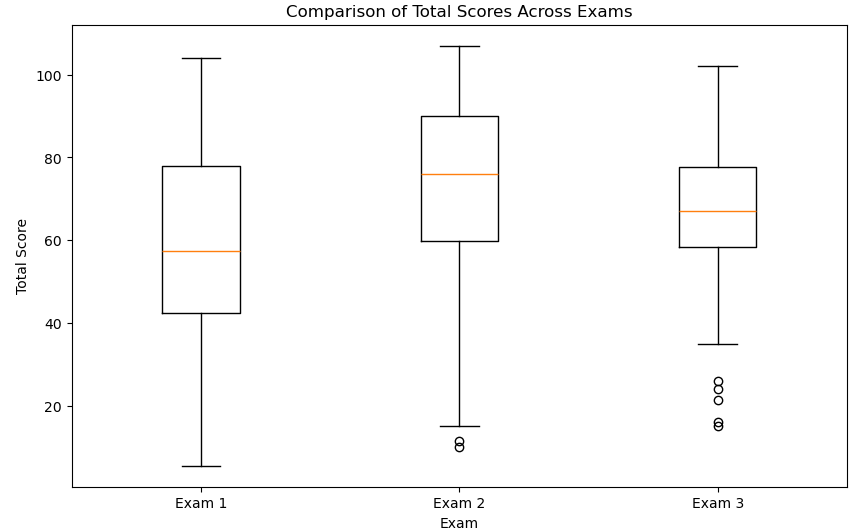
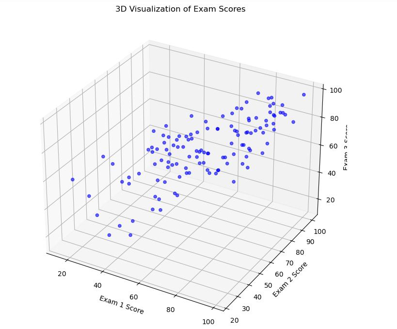
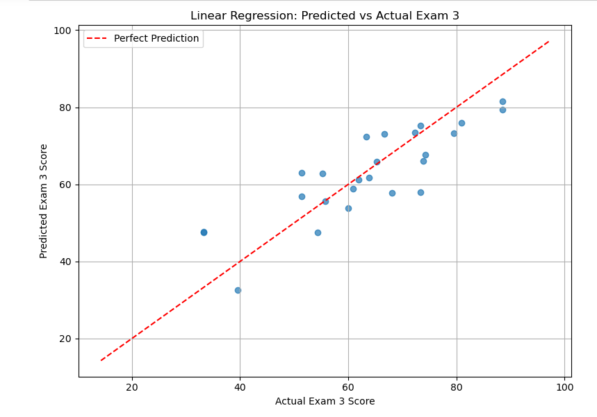

# Exploring Predictive Models for Student Performance: A Case Study in Life Science Calculus I Exam Data Modeling

## Real-World Problem Statement
**Full statement of the problem:**  
With final exams quickly approaching, students are often dreading the finals grind filled with lots of caffeine and an overwhelming amount of studying. Professors are equally yearning for the semester’s close as class attendance dwindles and assignments to finish grading stack up. 

But are final exams an accurate representation of student knowledge and performance in a course – or can we just accept the exams taken during the semester as good enough?

## Assumptions
1. **Exam scores reflect student learning and effort.**  
   Exams are standardized and graded consistently.  
2. **In absence of final grade data, Exam 3 can serve as a proxy for overall course performance.**
3. **All exams cover the same amount of content**
4. **All exams have the same difficulty**
5. **Content delivered to students consistently throughout the semester**

*Why these are sensible:*  
- Midterm exams are designed to test core course material, so their scores should reflect student learning and effort.  
- Using Exam 3 as a stand-in for final performance allows us to move forward without needing official final grades, which fits within our project timeline.  
- Assuming all exams cover the same amount of material and are equally difficult makes it reasonable to compare scores directly across exams.  
- Consistent delivery of content throughout the semester supports the idea that exam scores measure the same skills and knowledge at each point.  
- Standardized grading ensures that differences in scores are due to student performance rather than grading inconsistencies.

## Fields of Mathematics that might help
### 1. Statistics
*Analyze data on student performance across different exams in a standardized way*
- Descriptive statistics (like mean, medium, standard deviation, etc) to compare performance on midterm exams versus final exam
- Inferential statistics (like t-tests, ANOVA, etc) to determine if these differences are statistically significant
- Correlation and regression models (like linear or logistic regression) to see how well midterm exams predict final exam scores
### 2. Probability Theory
*Visualize data distribution of student performance for each exam* 
- Probability distributions to understand skewness, variability and outliers
- Bayesian inference to update prediction model by refining inferences as more student data is collected
### 3. Machine Learning
*To build predictive models for student success without relying solely on finals*
- Supervised learning (like linear regression) to try to predict final exam grades based on midterm exam grades
- Classification models to categorize students by their performance levels

## Modeling Setup and Dataset Information
The dataset was obtained from the USF Life Science Calculus I section 002 of Spring 2025. It contains information on students' exam scores for exams 1, 2 and 3. Students are all taught by the same professor and exams are graded by the same 4 graders. 

**Please note that the dataset is not included here because it contains sensitive information, and this page is publicly accessible.**

### Variables 
For the purposes of this project, the following variables were analyzed:
| Variable Name   | Description                              | Type     | Example Value |
|-----------------|------------------------------------------|----------|---------------|
| `SID`| Student ID | `number` | `123456788` |
| `Total Score`| Student's score on Exam | `number` | `98` |
| `Max Points`| Highest amount of Points a student could obtain | `number` | `105` |
| `Status`| Whether exam was graded or missing | `string` | `Graded or Missing` |

### Summary Statistics of the Dataset
Number of students: 160 
| Variable Name   | Exam 1     | Exam 2     | Exam 3     |
|-----------------|----------|----------|----------|
| `Mean`|  `59.163` | `73.064` | `66.531` |
| `Q1`|  `42.5` | `59.875` | `58.25` |
| `Q3`|  `78.0` | `90.125` | `77.75` |
| `Median`| `57.5` | `76.0` | `67.0` |
| `Maximum`|  `104.0` | `107.0` | `102.0` |
| `Minimum`|  `5.5` | `10.0` | `15.0` |
| `Count of Missing`|  `7` | `12` | `33` |
| `Max Points (Available)`|  `105` | `107` | `105` |

**Please Note:**
- Because each exam had a different maximum number of points available (e.g., 105, 107), **all exam scores were converted to percentages to ensure comparability across exams.**
- **Students missing a grade for any of the three exams were excluded from the final dataset.** This decision was made to maintain consistency in the analysis and to ensure that all models were trained and evaluated on complete information.

## Mathematical Tools

- **Linear Regression**  
  - **Why:** To predict a student’s Exam 3 score using their Exam 1 and Exam 2 scores.  
  - **How:** We draw the best straight line through the data points so it’s as close as possible to all the exam scores.

- **Logistic Regression**  
  - **Why:** 
  - **How:** 

- **K-Means Clustering**  
  - **Why:** To find natural groups of students based on their three exam scores.  
  - **How:** We pick a number of groups (k), place a point for each group, assign students to the closest point, then move those points to the average of their assigned students until it stops changing.

- **Cross-Validation**  
  - **Why:** To check if our models work well on new data.  
  - **How:** We split the data into parts, train the model on some parts and test on the rest, then repeat for each part and average the results.

- **Silhouette Analysis**  
  - **Why:** To see how clear the clusters are.  
  - **How:** We measure for each student how close they are to their own group compared to the next closest group, then average those scores.

## Variations on the Same Theme

### Simplest Version of the Problem

The simplest version of our problem is:  
**Can we predict a student's Exam 3 score using only their Exam 1 and Exam 2 scores?**
 
- We **cut out** any information about homework, quizzes, participation, or attendance, even though these likely contribute to final course grades. These additional factors would require more complex models, and we do not have access to that data.
- We **kept** Exam 1 and Exam 2 scores because they are standardized, graded consistently, and readily available for all students. They provide a focused, measurable snapshot of student learning during the semester.
- By narrowing it down to only midterm exams, we reduce the number of variables, avoid introducing noise from incomplete or subjective data, and focus purely on major, objective assessments.
- This approach is manageable within the timeframe of the project and aligns directly with our goal: testing whether mid-semester performance alone can be a strong enough indicator of final outcomes without needing to rely on final exams.

### Solving the Simplest Version

**Approach 1: Linear Regression**
Linear regression draws the best straight line through the data points to predict Exam 3 scores based on Exam 1 and Exam 2 scores. It finds the line that keeps the distance between the actual scores and the predicted scores as small as possible. The model gives a formula that shows how much each exam contributes to the final predicted score. It is simple to predict a number (like an exam score) and it lets us see clearly how Exam 1 and Exam 2 relate to Exam 3.It also gives a good starting point before trying more complicated methods.

**Code**

[Linear Regression Model Script](code/Student_Scores_Linear.ipynb)

**Results**
#### 3D Visualization of Exam Scores   

#### Predicted vs. Actual Exam 3   

#### Model Metrics 
| Metric  | Value     |
|-----------------|----------|
| `MAE`|  `6.57` |
| `RMSE`|  `7.85` |
| `R^2 Score`|  `0.71` |
| `Intercept`| `9.34` | 
| `Exam 1 coefficient`|  `0.23` | 
| `Exam 2 coeeficient`|  `0.54` | 

#### What this means
- **R² = 0.71**  
  About 71% of the variation in Exam 3 can be explained by Exams 1 and 2.  
- **MAE ≈ 6.6, RMSE ≈ 7.9**  
  On average we’re off by 6–8 percentage points when we predict Exam 3.  
- **Intercept = 9.34**  
  Even with 0% on the first two exams, the model predicts ~9% on Exam 3.  
- **Weights (0.23 vs 0.54)**  
  Each extra percent on Exam 1 adds 0.23% to the predicted Exam 3, while each percent on Exam 2 adds 0.54%. That tells us Exam 2 is roughly twice as important for predicting the final exam score.

**Approach 2: Logistic Regression with Cross Validation**

**Approach 3: K-Means Clustering with Silhouette Analysis**
K-Means looks at students’ Exam 1, Exam 2, and Exam 3 scores and tries to group them into clusters based on how similar their scores are. The algorithm starts by guessing some group centers, then moves them around until students are close to the center of their group. It lets us find natural groups, like students who did well all semester, students who improved, or students who struggled. Silhouette analysis will allow us to check how well the students fit into their clusters by seeing if they are closer to their own group than to other groups. It ensures that the clusters identified make sense and aren't just random.

**Code**
**Results**

## Variations of the Problem

## The Pitch
